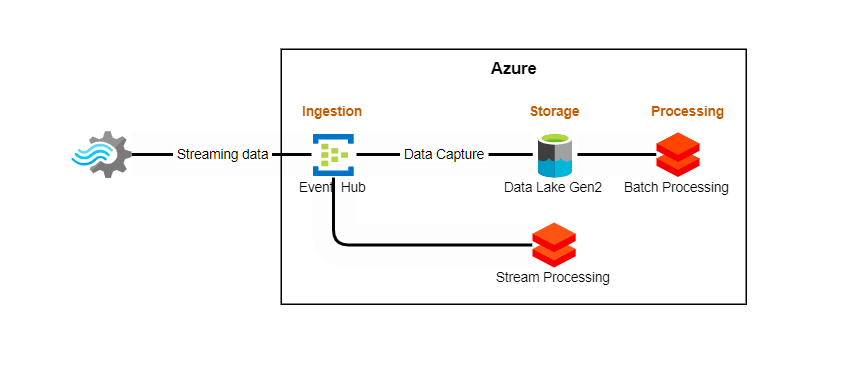
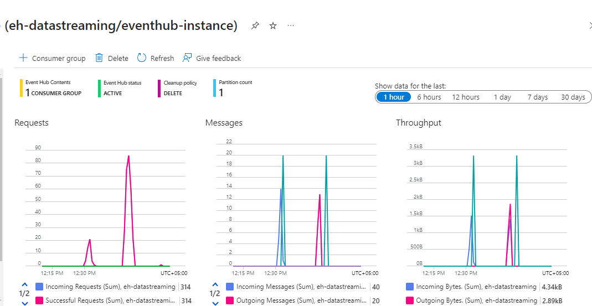
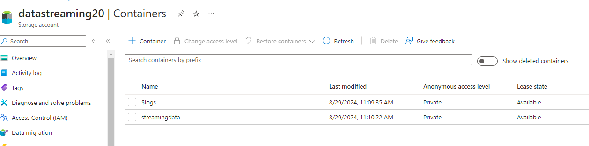
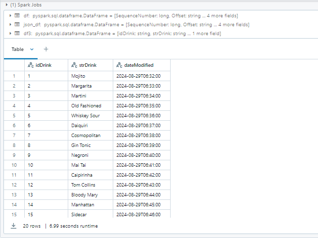
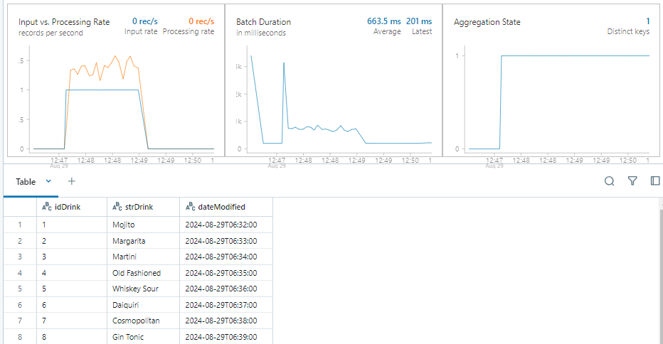

# Real-Time Data Processing with Azure

## Project Overview

This project demonstrates an end-to-end pipeline for real-time data processing and analytics using Azure services. The architecture integrates data generation, ingestion, storage, and processing, enabling both real-time and batch analytics.

## Architecture

The architecture integrates key Azure services for efficient data processing. A Python producer sends data to Azure Event Hubs, which ingests and forwards it to Azure Data Lake Storage for scalable storage and Azure Databricks for both batch and real-time stream processing. This setup ensures seamless handling of real-time and batch data workflows.

## Key Components

- **Data Generation**: A Python producer script simulates real-time data streams and sends data to Azure Event Hubs.

- **Data Ingestion**: Azure Event Hubs acts as the ingestion layer, receiving data from the Python script.

- **Data Storage**: The ingested data is stored in Azure Data Lake Storage in Avro format, providing scalable and durable storage.

- **Data Processing**: Azure Databricks is used to process the data through:
  - **Batch Processing**: Reads and processes stored data from Azure Data Lake.

  

  - **Stream Processing**: Processes real-time data directly from Azure Event Hubs for low-latency analytics.

  

## Key Features

- **Real-Time Data Ingestion**: Continuous data ingestion into Azure Event Hubs for real-time processing.
- **Scalable Storage**: Durable storage of data in Azure Data Lake, optimized for both performance and cost.
- **Flexible Processing**: Azure Databricks supports both batch and stream processing, allowing versatile data analytics.

## Technologies Used

- **Python**: Utilized for generating and sending data to Azure Event Hubs.
- **Azure Event Hubs**: Central component for data ingestion, enabling real-time streaming.
- **Azure Data Lake Storage**: Provides scalable, cost-effective storage for ingested data.
- **Azure Databricks**: Facilitates both batch and real-time processing of data for comprehensive analytics.

## Conclusion

This project demonstrates the integration of various Azure services to build a robust data processing pipeline suitable for both real-time and batch analytics.